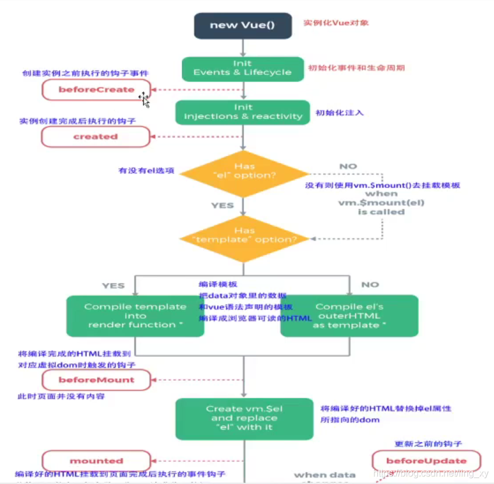
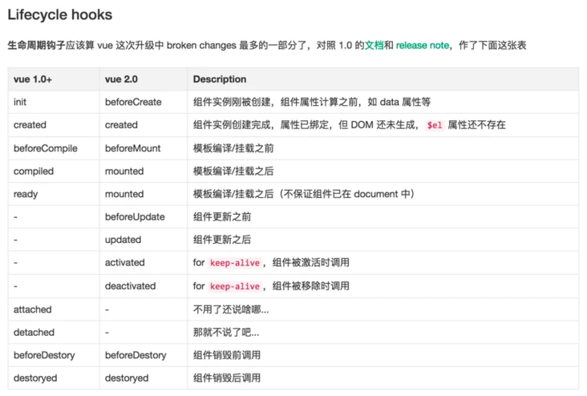

## 前言
使用了一段时间vue之后，虽然知道怎么和后端进行数据交互，但使用最多的还是使用created这个生命周期。
对于其他生命周期还是不甚了解，只会简单的使用。

## 什么是生命周期
从Vue实例创建、运行、到销毁期间，总是伴随 
各式各样的事件，这些事件统称为生命周期

## Vue2生命周期图



对于生命周期的执行顺序可以从上图得知。

图片来源：https://blog.csdn.net/ling_xy/article/details/119566227

## 八大生命周期
```vue
    beforeCreate，created，beforeMount，mounted，beforeUpdate，updated，beforeDestroy，destroyed
```
### 创建
#### beforeCreate
此时组件的props、methods、data、computed、watchd，DOM结构没初始化，什么也做不了
#### created
此时组件的props、methods、data、computed、watc可用，但是DOM结构仍然没有初始化，此时可以发起ajax请求

### 挂载
#### beforeMount
此时只是生成render函数，并没有执行生成vnode，所以我们也看不到页面
#### mounted
挂载完成，整个创建过程完成。此时我们可以在页面看到真实的数据

### vue的挂载是什么？
将组件渲染，并且构造 DOM 元素然后塞入页面的过程称为组件的挂载
ps. 以上流程只会在初始化时执行一次，之后不会再被触发

### 运行
#### beforeUpadte
data被改变时触发 此时数据是新的，但页面呈现仍然是旧数据
#### updated
更新完毕触发生成vnode，转换为真实DOM，然后插入，此时页面呈现的是最新的


### 销毁
#### beforeDestroy
组件要销毁前触发此时可以使用vm的所有属性和方法
#### destroyed
组件被销毁后触发